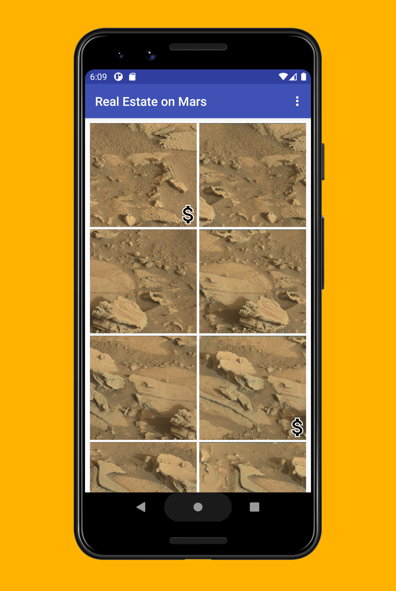

## Marsland

Marsland is a Mars Real Estate, which shows properties for sale on Mars. This app connects to a web service to retrieve and display the property data, including details such as the price and whether the property is available for sale or rent. The images representing each property are real-life photos from Mars captured from NASA's Mars rovers.

## Screenshots

  
   
